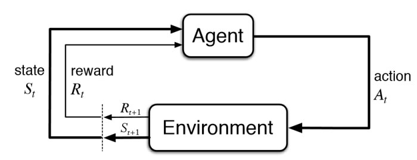
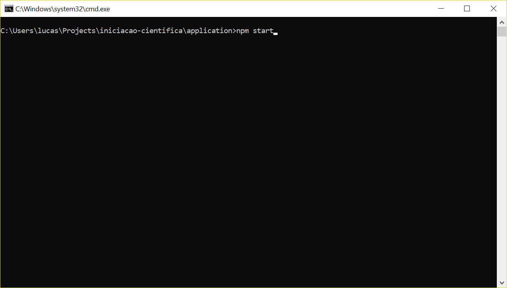
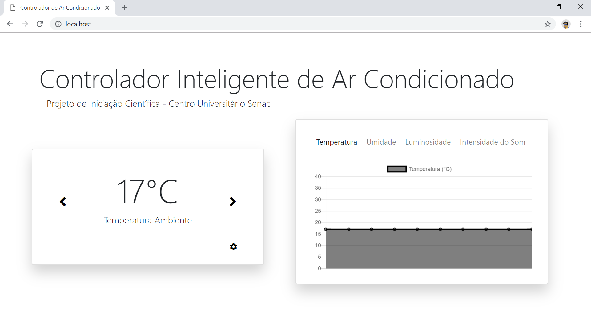

# Controlador de Ar Condicionado

Protótipo de Sistema Inteligente Controlador de Ar Condicionado

## Sobre o projeto

Este projeto tem como objetivo fornecer uma base para um sistema de controle inteligente de ar condicionado.
Para isso faremos uso de sensores para coletar os dados do ambiente e aplicaremos técnicas de inteligência artifical
nos dados coletados para treinar uma rede neural a manter o ambiente sempre agradável de acordo com as preferências do usuário.

### Aprendizagem por reforço



Utilizamos o conecito **Aprendizagem por reforço**, onde nesse caso teremos:

1. Agente: Será a rede neural, que irá aprender a controlar o sistema.
2. Ambiente: Será caracterizado pelas medições do sensores (temperatura, umidade, luminosidade, intensidade do som).
3. Ações: Serão uma das três ações: A = { aumentar temperatura em uma unidade, abaixar temperatura em uma unidade, nada }. 

Portanto os objetivo principal do projeto é estabelecer um sistema de coleta de dados, aonde cada registro irá conter os dados do ambiente e a ação tomadada (aumentou a temperatura, abaixou a temperatura, etc.). Estes dados irão definir a preferência de temperatura do usuário e a rede deverá aprender a reagir com estes dados.

### Controle de Temperatura

Em um ar condicionado moderno, apenas selecionamos a temperatura e ele automaticamente ajusta a temperatura ambiente
a aquela desejada. Isso é feito usando termômetros internos. No nosso sistema, não desejamos perder essa característica,
mas queremos que a rede aprenda as nossas preferências para que não seja necessário definir a temperatura manualmente.
Para isso estamos assumindo que a rede usará um **comando básico para aumentar/diminuir a temperatura**.

Este comando **não irá funcionar como o descritor no parágrafo anterior**. Ao enviar um comando `aumentar-temperatura`, o comportamento que o sistema espera é que aja uma mudança perceptível na temperatura ambiente entre o envio do comando e próxima amostragem do ambiente.  

### Coleta de dados

Como dito, o objetivo é coletar dados que descrevam a preferência do usuário.
Para isso, coletamos os sinais exatamente quando eles são enviados pelo usuário, ou seja,
se o usuário mandar aumentar a temperatura, o sistema irá coletar os dados do ambiente e salvar no banco de dados junto com a ação
correspondente à `aumentar-temperatura`. Esta ação pode ser um número, umm enum, um string, etc. desde que exista um para cada ação.

O sistema tem uma ação especial, a ação `nothing` de não fazer nada. Quando o sistema escolhe esta ação significa que o ambiente está agradável. Este sinal nunca será emitido pelo usuário, pois se o ambiente está agradável ele não irá alterar a temperatura !
Para resolver o problema, a rede captura a cada **20 minutos** a temperatura e assume que ela está agradável. O tempo usado como estimativa para o usuário se sentir desconfortável e ajustar da temperatura é de 5 minutos..

## Tutorial

Segue abaixo um tutorial de como instalar toda a parte de infraestrutura de software do sistema.
Assume conhecimentos em:

1. Programação
2. Redes
3. Sistema Operacional
4. Navegação Web

### 1 - Programação do MCU (Wemos)

Segue o guia completo para programação do MCU usado no projeto.

#### 1.1 - Setup do Ambiente

Para começar, baixe o editor de texto Atom (https://atom.io/) e instale.
Depois, abra o editor de texto e depois abra o menu de configurações do editor (File -> Settings), 
e procure pela opção Install.

No menu que se abrir, digite na barra de buscas platformio-ide e instale a opção com o nome correspondente.
Durante a instalação será solicita a instalação do **CLANG**, quando isto acontecer **RECUSE** pois
não é necessário para gravação do firmware simples que faremos e além do mais, este **plugin (PlatformIO)** por
si só tende a ter problemas com as atualizações, o CLANG seria mais um componente para proliferar os bugs.

Após o uso deste **plugin (PlatformIO)** eu recomendo a desinstação do mesmo, caso queria continuar a usa o Atom como editor,
ou a instalação de um outro editor de texto, que é o que faremos a seguir.
Segue um link, em inglês, com imagens para auxiliar na instalação do PlatformIo (http://docs.platformio.org/en/latest/ide/atom.html#installation)
 
#### 1.2 - Download das bibliotecas

Com o editor de texto **Atom** aberto, procure no menu principal a opção `PlatformIO -> PlatformIO Home`.
Na página que se abrir, procure no menu pela opção **Libraries**, digite na barra de busca **"aREST"**
e instale **apenas a opção com o nome correspondente** (pode surgir uma opção com nome aREST UI ou bREST, não instale nenhuma destas).

#### 1.3 - Setup do Projeto

Vá até a página principal deste projeto e selecione a opção `Clone or download -> Download Zip` para fazer download deste projeto.
Extraia o conteúdo do zip, renomeie a pasta **"iniciacao-cientifica-master"** para **"iniciacao-cientifica"** e copie esta pasta
para o seu Desktop.

Com o editor de texto **Atom** aberto, vá novamente na opção `PlatformIO -> PlatformIO Home` e deste vez selecione no menu
a opção **Home**. Selecione no menu Quick Access a opção **"Open Project"**. Navegue até o diretório do projeto 
e abra o projeto **"Firmware"**. Caso tudo ocorrá bem, você verá a árvore do diretório no editor de texto.
Utilizando um cabo USB, conecte o Wemos ao computador e no menu do Atom, selecione a opção 
**PlatformIO -> Upload** para descarregar o firmware do Wemos. 

Caso tudo tenha ocorrido corretamente, você verá o led piscar rapidamente, indicando a gravação do código no MCU.

#### 1.4 - Configuração do Wemos

Abra no editor de texto o arquivo **main.cpp**, dentro da pasta src, e procure pelo seguinte trecho de código:
```cpp
  namespace wifi {
  
    // autenticação
    const char * ssid = "Minha Rede Wifi";
    const char * password = "Minha Senha";
   
    // Configurações de IP
    IPAddress ip(192, 168, 0, 200);
    IPAddress gateway(192, 168, 0, 1);
    IPAddress subnet(255, 255, 255, 0);
    
    // resto do código omitido ...
  }
```
Insira os dados da sua rede e descarrege (upload) o firmware novamente no dispositivo.

#### 1.5 - Verificação do Dispositivo

Para saber se tudo ocorreu bem, uma medida simples de relatório foi implementada usando o led embutido no **Wemos**.

Após a gravação do dispositivo, verifique o **led azul** piscando na placa. Caso ele esteja piscando **LENTAMENTE**,
ou mais especificamente, **em intervalos de 1 segundo**, o dispositivo está tendo problemas para se conectar à rede wifi.

Caso esteja piscando mais rapidamente, **em intervalos de 0.3 segundo**, o dispositivo está funcionando normalmente.

Resumindo, caso você consiga contar o **tempo que o led ficou aceso**, 
significa que as **configurações de rede estão incorretas**.

#### 1.6 - Verificação dos Endpoints

A biblioteca (aREST) que instalamos anteriormente expoe parâmetros do dispositivo como endpoints REST. Por exemplo,
no trecho de código encontrado no arquivo **"main.cpp"**, declaramos variáveis para armazenar o valor lido pelos sensores:
```cpp
namespace model {

  // variáveis para armazenar as leituras de sensores
  double temperature = 0.0;
  // ...  
  
  /*
  * Lê o sensor de temperatura
  */
  double readTemperature() {
    return random(0, 40);       // implementar aqui a função que realmente irá ler a temperatura
  }
}
```
Mais abaixo, na função `setup()` declaramos o seguinte trecho:

```cpp

// objeto de api rest e do servidor
WiFiServer server(80);
aREST rest = aREST();

void setup() {
  
  // trecho de código omitido ...
  
  rest.variable("temperature", &model:temperature);
  
  // ...
}
```
Este trecho de código cria um link entre o valor da variável temperature e o um endpoints rest no formato:

`http://{ip do wemos}/temperature`

Abra o navegador (Chrome, Edge, etc) e digite na barra de navegação
o endereço sugerido, substituindo **{ip do wemos}** pelo ip inserido no código:

```cpp
namespace wifi {
  
  // trecho de código omitido ...  
  
  // Este é o endereço do exemplo, você deve colocar de acordo com suas configurações de rede
  IPAddress ip(192, 168, 0, 200);
  
  // ...
  
}
```
Você verá o valor 0. Este valor irá ficar assim pois declaramos a variável e ligamos ela ao endpoit mas ainda não
temos um método que atualiza ela, então vamos usar o método `double readTemperature()` no loop principal para atualizar
a variável `temperature` com o valor lido pelo sensor, ou seja:

```cpp
void loop() {

  // trecho de código omitido ...
  
  model::temperature = model::readTemperature();
  
  // ...
  
}
```
Desta forma, toda vez que você digitar o endereço na barra de navegação e clicar enter, verá um valor diferente.
Resta substituir o `random()` pela implementação real do sensor.
Para os outros sensores o procedimento é o mesmo e já estâo implementados os sensores de:
1. Temperatura
2. Umidade
3. Luminosidade
4. Intensidade do Som

#### 1.7 - Implementação de Controles

Também é possível **ligar métodos aos endpoints**, no exemplo abaixo criamos uma função e ligamos ela a um endpoits
`http://{ip do wemos}/{nome da função}` à execução daquela função. Isto signfica que se digitarmos o endereço do endpoint
no navegador da mesma forma que fizemos com as variáveis, esta função será chamada no microcontrolador.
A assinatura destas funções devem **sempre** retornar um `int` e recebem como argumento uma `String`.

```cpp
namespace controllers {

  // trecho de código omitido ...
  
  /*
  * Aumenta em uma unidade a temperatura do ar condicionado
  */
  int increaseTemperature(String) {
    statusLed::on();
    delay(5000);
    statusLed::off();
    return 0;
  }
  
  // ...
  
}

// ...

void setup() {

  // trecho de código omitido ...
  
  rest.function("increase-temperature", controllers::increaseTemperature);
  
  // ...
  
}

```
Este recurso será de utilidade para implementar os métodos que irão atuar no ar condicionado. No código já estão implementados os métodos:
1. turnOn: Liga o Ar Condicionado
2. turnOff: Desliga o Ar Condicionado
3. increaseTemperature: Aumenta a Temperatura em uma unidade
4. decreaseTemperature: Diminui a Temperature em uma unidade

Para saber mais sobre as funções da biblioteca **aREST** viside a página https://github.com/marcoschwartz/aREST.

#### 1.8 - Finalizando o sistema

Agora que temos tudo funcionando, podemos ligar os sensores no sistema e testar utilizando as ferramentas apresentadas
o funcionamento do sistema.

#### 2 - Utilização da API
 
#### 2.1 - Setup do Ambiente
Faça o download e instale os seguintes programas:

1. **NodeJS** -> https://nodejs.org/en/download/
2. **MongoDB (Community Server)** -> https://www.mongodb.com/download-center
3. **Visual Studio Code** -> https://code.visualstudio.com/

*Prestar atenção durante o download do **MongoDB** para selecionar a opção **Community Server** e não a opção **Atlas**.*

Após completar a instalação de todos os programas acima, abra o **Visual Studio Code** e selecione a opção
`File -> Open Folder` e selecionar a pasta **application** dentro da pasta do projeto (iniciacao-cientifica).

#### 2.2 - Link com Dispositivo

Com o projeto aberto no **Visual Studio Code**, abra o arquivo `device-proxy.js`, dentro da pasta `routes/api`
e procure pelo seguinte trecho de código:

```javascript

// ###############################################################################################
// # Modelo
// ###############################################################################################

// um minuto
const ONE_MINUTE = 1000 * 60;

// frequência que as amostras são salvas no banco de dados
const SAMPLE_FREQUENCY = 20 * ONE_MINUTE;

// frequência que a rede toma decisões
var DECISION_FREQUENCY = 10 * ONE_MINUTE;

// endereço ip do dispositivo (wemos, arduino, etc)
const DEVICE_ADDR = '192.168.0.200';

// arquivo que armazena a rede neural
const NETWORK_FILE = 'network.json';

// mapa de comandos
let COMMANDS = [
    'nothing',    
    'increase-temperature',
    'decrease-temperature',
    'turn-on',
    'turn-off'
];

```
Na opção `DEVICE_ADDR` digite, no formato de string, o endereço ip selecionado para o dispositivo. As outras opções serão apresentadas
mais a frente.

#### 2.3 - Endpoints
Este aplicativo que instalamos serve como um proxy para o Wemos que fornece uma segurança maior na conexão 
e também alguns outros serviços interessantes como **banco de dados** e **inteligência artificial**.
Todos os serviços estão mapeados nos seguintes endpoints:

| HTTP verbs    | Endpoints                               | Recurso                                                   |
|:-------------:| --------------------------------------- | --------------------------------------------------------- |
| GET           | /api/scenes                             | Retorna todas as cenas coletadas pelo sistema             |
| POST          | /api/scenes                             | Salva uma nova cena no banco de dados                     |
| GET           | /api/device-proxy                       | Retorna os dados dos sensores em tempo real               |
| GET           | /api/device-proxy/activate              | Ativa o serviço de proxy do dispositivo                   |
| GET           | /api/device-proxy/deactivate            | Desativa o serviço de proxy do dispositivo                |
| GET           | /api/device-proxy/turn-on               | Liga o ar condicionado                                    |
| GET           | /api/device-proxy/turn-off              | Desliga o ar condicionado                                 |
| GET           | /api/device-proxy/increase-temperature  | Aumenta a temperatura do ar condicionado em uma unidade   |
| GET           | /api/device-proxy/decrease-temperature  | Diminui a temperatura do ar condicionado em uma unidade   |
| GET           | /api/device-proxy/activate-controller   | Ativa o serviço de controle inteligente do dispositivo    |
| GET           | /api/device-proxy/deactivate-controller | Desativa o serviço de controle inteligente do dispositivo |
| GET           | /api/device-proxy/train-controller      | Treina o serviço de controle inteligente do dispositivo   |

#### 2.4 - Utilizando o Dashboard

Abra o terminal de comando e navegue até a pasta `iniciacao-cientifica/application` e digite o comando `npm start`.



Abra o navegador e digite o endereço `localhost`. Se tudo ocorreu bem até agora você verá a página do dashboard.



Este dash board apresenta as funcionalidades da tabela acima de uma maneira mais acessível.

1. Para abaixar/aumentar a temperatura, utilize as sextas ao lado do mostrador de temperatura
2. Para abrir o menu de comandos, seleciona a engrenagem próxima ao mostrador de temperatura
3. Para trocar o gráfico sendo mostrado, basta utilizar a barra de navegação instalada.

Com o sistema todo conectado, utilize o dashboard para enviar o comando `Ativar Proxy` para o sistema 
e você verá os gráficos variando com a nova informações que sai dos dispositivos.
